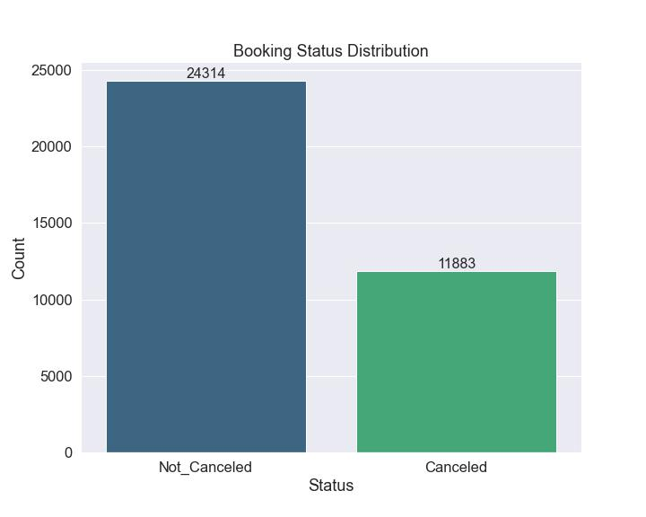
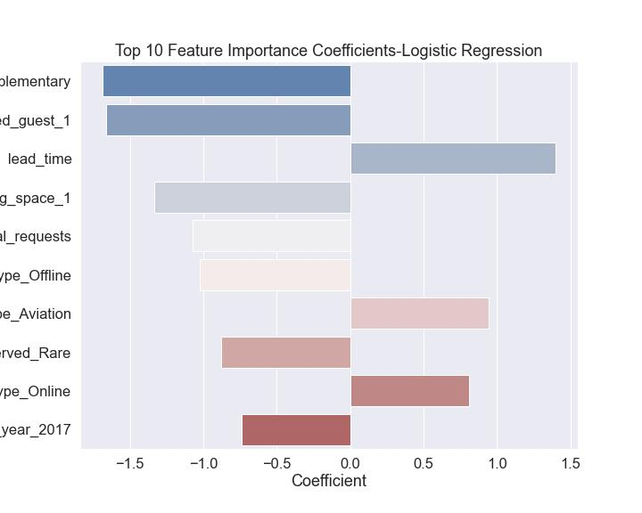
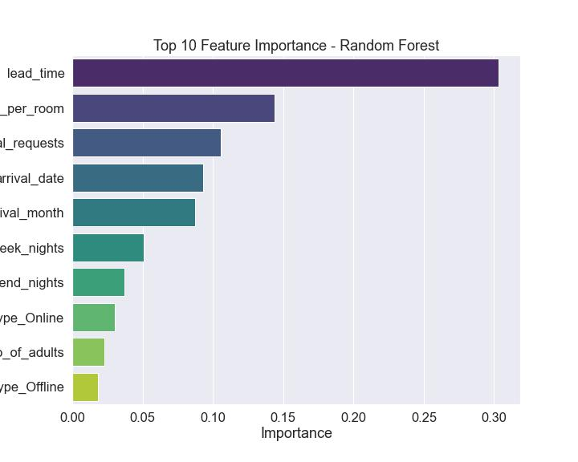
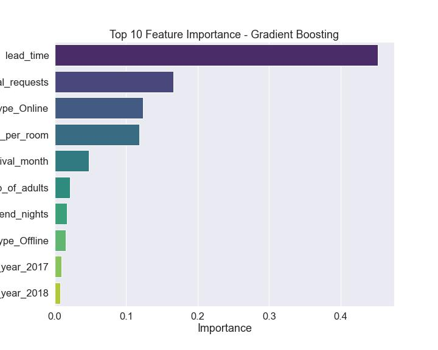
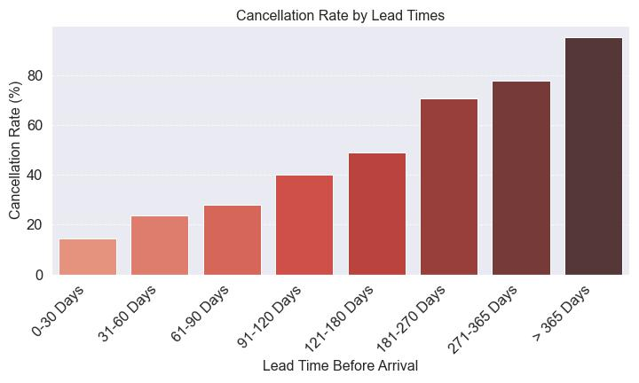
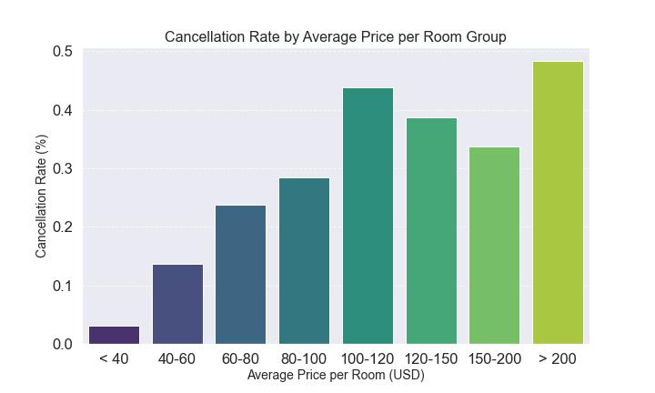

# Predicting Hotel Reservation Cancellations

Author: [Morgan Nash](mailto:morganmichellenash@gmail.com)

December 2025

See the full analysis in the [Jupyter Notebook](notebook.ipynb) 

# Project Objective:
The goal of this project is to create a predictive classification model that identifies when a hotel reservation is high-risk before it's cancelled, allowing your team to proactively intervene. We try several classification models and select a top performing model with high Precision to minimize the cost of offering unnecessary incentives to committed guests.

# Business Understanding:

Maintaining occupancy is a huge challenge for the modern hotel industry. Intense competition, outdated technology systems, as well as the ease of online booking (and cancelling), are just a few of the issues that hotels are required to battle. It goes without saying that every cancelled booking means revenue is lost. 

* Aggressive pricing from competitors, along with the rise of short-term rental platforms like AirBnb, make guest retention increasingly difficult.
  
* On top of that, many of the hotel reservation systems are outdated and lack the capabilities that are needed to predict customer behavior, limiting the reliability of reservation projections.
  
* Another reason for occupancy struggles is the ease of online booking and common "free cancellation" policies. This allows for customers to make multiple reservations simultaneously, which greatly increases the chance of last-minute cancellations.

With all of this, it's not shocking that your hotel is having issues with cancelled reservations, and we understand the immediate need for a predictive intervention system. 

We are hoping to help with that by creating a classification model that predicts when a hotel reservation is "high risk" so your team can intervene and reach out with incentives to secure the booking.

# Data Understanding:

This project uses the Hotel Reservations Dataset, accessed via [Kaggle](https://www.kaggle.com/datasets/ahsan81/hotel-reservations-classification-dataset/data), and contains 36,275 records detailing customer reservations and characteristics from 2017 to 2018. This dataset is a good choice for this project for the following reasons:

* It contains real data, rather than synthethic. This data represents genuine booking activity from a single hotel, although the hotel location is undisclosed. This means our classification model will learn patterns based on real data which allows us to derive practical insights from the real customer behavior.

* It has a binary target: booking_status ('Canceled' or 'Not_Canceled')

* It contains a mix of variables that can be tied to a customer's likelihood to cancel including:

    - Customer Demographics: number of adults and children, whether customer was a repeat guest or not
    - Customer Behavior: number of weekend and weeknights booked, type of meal plan, lead time (days between booking and arrival), special requests, past booking history, whether or not a parking space was required
    - Financial & Operational Information: Average room price, room type

This Data Dictionary, taken from the dataset's Kaggle page, describes each of the 19 columns:

**Booking_ID:** unique identifier of each booking

**no_of_adults:** Number of adults

**no_of_children:** Number of Children

**no_of_weekend_nights:** Number of weekend nights (Saturday or Sunday) the guest stayed or booked to stay at the hotel

**no_of_week_nights:** Number of week nights (Monday to Friday) the guest stayed or booked to stay at the hotel

**type_of_meal_plan:** Type of meal plan booked by the customer:

**required_car_parking_space:** Does the customer require a car parking space? (0 - No, 1- Yes)

**room_type_reserved:** Type of room reserved by the customer. The values are ciphered (encoded) by INN Hotels.

**lead_time:** Number of days between the date of booking and the arrival date

**arrival_year:** Year of arrival date

**arrival_month:** Month of arrival date

**arrival_date:** Date of the month

**market_segment_type:** Market segment designation

**repeated_guest:** Is the customer a repeated guest? (0 - No, 1- Yes)

**no_of_previous_cancellations:** Number of previous bookings that were canceled by the customer prior to the current booking

**no_of_previous_bookings_not_canceled:** Number of previous bookings not canceled by the customer prior to the current booking

**avg_price_per_room:** Average price per day of the reservation; prices of the rooms are dynamic. (in euros)

**no_of_special_requests:** Total number of special requests made by the customer (e.g. high floor, view from the room, etc)

**booking_status:** Flag indicating if the booking was canceled or not.

### Data Limitations:
The following list contains this dataset's primary limitations, and focuses on factors that could impact the model's generalizability:

* **Limited Geographic Scope and Timeline:** The data is restricted to a 1 hotel only and is slightly outdated with the latest record from 2018 (before the Covid-19 Pandemic). The hotel location is also undisclosed. The dataset creator, Ahsan Raza, commented in the Discussion section: "This example data has been captured from single location/country which, due to discretionary reasons, cannot be disclosed." This adds a limit to the model's ability to generalize well to other locations after 2018.

* **Missing External and Factors:** The dataset lacks external and economic influences. Information about competitor pricing, weather forecasts, or large events taking place nearby are just to name a few outside factors that frequently drive cancellation decisions, but they are invisible to the current model.

* **Lack of Detailed Guest and Pricing Data:** Certain customer demographic details (like age and income), as well as records of the actual price paid by the customers (only the average is included) are absent. This limits the model's ability to truly understand a customer's price sensitivity.

* **Feature Ambiguity:** Interpretation is hampered by the ciphered room type values (ie. room type, meal plan type), which cannot be leveraged fully without the encoding key, which is not included. 

## Data Preparation:
The following list summarizes the steps we took to prepare our data for modeling:

1. **Data Cleaning:**
- Unique Identification: Removed the Booking_ID column as it held no predictive power.
- Duplicate Management: Scanned for and removed duplicate records to prevent artificial bias in model training.
- Target Encoding: Created the target column "is_canceled" by mapping "booking_status" values (Canceled = 1, Not_Canceled = 0).
- Validation: Identified and removed logically inconsistent records, specifically instances where the total number of stay nights (weekend + weeknights) was zero.

2. **Feature Engineering:**
- Outlier Mitigation: To prevent extreme values from skewing model performance, manual maximum caps were applied to lead_time, no_of_children, no_of_week_nights, and previous booking/cancellation metrics.
- Category Consolidation: Addressed high-cardinality categorical features by consolidating low-frequency categories into "Other" or other broader labels, reducing noise and improving model stability.
- Data Type Casting: Explicitly converted discrete integer columns—required_car_parking_space, repeated_guest, and arrival_year—to object types to ensure the preprocessing pipeline treated them as categorical features rather than continuous values.

3. **Preprocessing & Baseline Setup:**
- Data Splitting: Used a Train-Test Split to ensure the models were evaluated on unseen data, effectively preventing data leakage.
- Baseline Establishment: Implemented a Dummy Classifier to generate baseline metrics (Accuracy, Precision, Recall), providing a benchmark to measure how well our models improved.

4. **Created Pipeline Transformations:**
- Categorical: Applied OneHotEncoder to transform categorical variables into a machine-readable format.
- Numerical: Applied StandardScaler to normalize continuous features, ensuring that columns with larger scales (like lead_time) do not disproportionately influence the model.

## Model Evaluation Metrics:¶
During modeling, we set "Canceled" reservations to 1, and reservationes that were "Not Canceled" to 0. Below, we explain the difference in the costs between False Positives and False Negatives:

**False Positive:** Our model predicts that a reservation is "high risk" but the guests were planning on showing up.

**Cost:** You end up spending money, time, and effort on trying to save a booking that was never at risk of canceling.
High Precision minimizes these False Positives. Of all predicted positives (cancellations), how many were correct? It is important because money spent on a customer who was already committed is a direct, unnecessary cost.

**False Negative:** Our model predicts the reservation was low-risk, but the guest actually canceled the booking.

**Cost:** You fail to intervene and lose the revenue associated with that booking.
High Recall minimizes False Negatives. Of all actual positives (cancellations), how many did we find? This is relevant for intervening to save bookings.

These costs are both very important to consider. Businesses often accept a slightly lower Recall if it means the model's Precision is very high, and they are highly confident in every intervention they make. To align with our goal of proactive cancellation prevention, we decide to prioritize a model with **High Precision** but still take other evaluation metrics into consideration including Accuracy and Recall.

# Modeling:

We decided to test the following models before selecting a top performer (High Precision) to fine tune its parameters:

**Logistic Regression:** simple, interpretable model that establishes a performance baseline and helps to clearly identify which features have a direct, positive or negative influence on the risk of cancellation.

**Random Forest:** bagging ensemble model that combines the predictions from hundreds of independent decision trees and is better at finding hidden, non-linear patterns in the data that a simple model might miss.

**Gradient Boosting:** boosting ensemble model that builds trees one after the other, with each new tree focused on fixing the errors made by the previous ones. This was included to challenge the Random Forest model.

For each type of model, we created a pipeline that uses the preprocessors (OneHotEncoder/StandardScaler) along with that specific model. Each pipeline was fit on the training data and predicted test data. A Classification Report, Confusion Matrix, ROC AUC score, and ROC Curve Plot are displayed for each pipeline. Finally, we evaluate Feature Importance from each model to gain insight on what features lead a reservation to be high-risk. (A reminder that feature importance is a relative score, not a percentage.) After we evaluated these models and looked at their Feature Importances, we tuned the top performing model.

## Model Evaluation:
Our models produced the following metrics:
**Logistic Regression:**
* Accuracy 78%
* Precision (Canceled=1) 64%
* Recall (Canceled=1) 76%
* AUC Score 0.860
  
**Random Forest:**
* Accuracy 90%
* Precision (Canceled=1) 86%
* Recall (Canceled=1) 81%
* AUC Score 0.9511
  
**Gradient Boosting:**
* Accuracy 85%
* Precision (Canceled=1) 81%
* Recall (Canceled=1) 70%
* AUC Score 0.909

## Top Model: Random Forest
The Random Forest model delivers superior performance across all key metrics: highest Accuracy, highest Precision, highest Recall, and the highest AUC Score. It effectively maximizes the chance of successfully identifying true high-risk cases while minimizing the financial risk associated with offering incentives to low-risk guests.

1. The Random Forest model achieved the highest overall Accuracy (90%), demonstrating it has the strongest ability to correctly classify both Canceled and Not Canceled reservations.

2. The Random Forest model has the highest Precision (86%). When the Random Forest predicts a booking will cancel, it is correct 86% of the time. This translates to the lowest rate of wasted intervention costs among all models.

3. The Random Forest model also acheived the best Recall (81%). It successfully identifies 81% of all actual cancellations, striking the best balance between catching high-risk guests and minimizing waste.

4. The Random Forest's AUC score also acheived the highest (0.9511). This means there is a 95.1% chance that the model will correctly distinguish between a randomly selected Canceled reservation and a randomly selected Not Canceled reservation. This indicates a high-quality ranking system for risk.

## Feature Importance Analysis:

Our analysis of Feature Importance across all three models points to three main categories of predictors that drive cancellation risk: Time Related Risk Factors, Loyalty/Commitment Signals, and Market/Pricing Factors:

1. **Time-Based Risk** (The Dominant Predictor):
       The **lead_time** between booking and arrival is the single most influential factor across all models, confirming that the longer the lead time, the less committed the guest is. (Using Logistic Regression, the sign of the coefficient tells us the direction of the relationship with the positive class (which is Canceled in this context). Lead_time coefficient is a Positive predictor, meaning that as the value of lead_time increases, the log-odds of the positive class (Canceled = 1) also increase.)

2. **Commitment Signals** (Strong predictors against cancellation): These features are strong negative predictors of cancellation. The Logistic Regression model, in particular, assigned them high negative magnitudes, and therefore we consider them as "anti-cancellation switches."
    - **no_of_special_requests** A high number of requests implies the guest is heavily invested in their stay details.
    - **repeated_guest_1** Being a repeat customer is the strongest loyalty indicator.
    - **required_car_parking_space_1** Requesting a parking space suggests a planned arrival with strong commitment. 
      
3. **Market and Pricing Factors**: The tree-based models (Random Forest and GradientBoosting) uncover the influence of pricing and market channel (how the reservation was booked), which the linear Logistic Regression model missed:
   - **avg_price_per_room** This is the second most important feature in the Random Forest model, but it didn't even make the top 10 for our Logistic Regression model. This suggests its relationship with cancellation is non-linear (and risk might be higher at both very low and very high price points, but low in the middle).
    - **market_segment_type_Online** Online bookings increase the risk of cancellation (often due to flexible cancellation policies).
    - **market_segment_type_Offline** Offline bookings decrease the risk of cancellation (often implies more commitment or corporate travel).

4. **Other Time-Related Features:** The Random Forest analysis specifically highlighted the importance of **arrival_date** and **arrival_month** which indicates that there are specific periods within the year when cancellation risk spikes, a pattern that the simple, linear Logistic Regression model may not be able to capture effectively.

This analysis, along with comparing the previous model results, confirms that a more sophisticated, non-linear model (Random Forest/Gradient Boosting) is necessary to capture the more complex relationships between time (lead time), pricing, and seasonality. 

## Random Forest Model Tuning:
To tune our Random Forest model, we defined a parameter grid and used Grid Search Cross-Validation to find the best parameters. The parameters we chose to tune are as following:

**n_estimators:** The number of trees in the forest. More trees generally mean better performance, but increases computation time.
[100, 200, 300]

**max_depth:** The maximum depth of each tree. Limiting this helps to prevent the model from overfitting.
[10, 20, 30]

**min_samples_leaf:** The minimum number of samples required to be at a leaf node. 1 is the default value and is common for classification models, allows for detailed trees.
[1, 2, 4]

Best Parameters using GridSearch (To achieve a High Precision of Canceled (1) Reservations:
- max_depth: 30
- min_samples_leaf: 1
- n_estimators: 300

  
### Final Model Metrics:
Our Final Tuned Model only showed very slight improvement to our previous Random Forest Model, with a slighly higher AUC score.

- **High Accuracy:**	90% The final model correctly predicted a reservation's booking status (either Canceled or Not Canceled) 90% of the time.
- **Great AUC Score:** 0.9515 This AUC Score shows our model's excellent ability to distinguish between high-risk and low-risk bookings.
- **High Precision Confirmed**: The 86% Precision for the Canceled (1) class ensures that the cost of intervention is minimized. Only 14% of interventions are "wasted" on guests who wouldn't have canceled anyway. When this model predicts a cancellation, it is correct 86 out of 100 times.
- **Excellent Recall**: The 82% Recall means our final model is also highly effective at capturing the cancellations you are trying to prevent. This model correctly identifies 82% of all actual cancellations.

# Conclusion:
We achieved our initial goal of building an optimized predictive model that classifies reservations as high-risk (or not) prior to arrival or cancellation. That final model was our Optimized Random Forest Classifier. 
Our final model acheived the following performance metrics (on the Test Set):
- Precision (Canceled=1): 86%
- Recall (Canceled=1): 82%
- AUC Score: 0.9515

# Next Steps:

## Proposed Deployment Strategy:
We recommend integrating the final model into the booking system to score all new reservations nightly with a Probability of Cancellation:

**Use the Model as a Scoring Engine:** The model’s **predict_proba()** function should be used to allow the system to generate a Probability of Cancellation (ranging from 0.0 to 1.0) for every reservation.

**Probability of Cancellation Tiers**

1. High-Risk (> 0.70): Proactive Intervention: Retain the guest before the cancellation window. The model's high precision justifies the cost of this incentive.

2. Medium-Risk (0.50 - 0.70): Monitoring/Soft Touch: Ensure commitment without incurring cost. Save high-value incentives for the most likely cancellations.

3. Low-Risk (< 0.50): No Action: Normal business operations. Minimal chance of wasted incentive.

**Batch Integration:** Every 24 hours, all new and modified reservations should be passed through the scoring engine.

**Threshold Management:** By default, machine learning models use a 0.50 threshold. However, to maintain our 86% Precision, we suggest implementing custom thresholding logic. You're team would be responsible to decide this. For an example, we suggest that bookings are only flagged for "Proactive Intervention" if their probability score exceeds 0.70, ensuring you only spend resources on the **most** certain cancellations.

**Develop Automated Alerting:** Develop an automatic alerting system so that reservations flagged as "High-Risk" automatically trigger a notification to the Reservations team for immediate action.

**Develop a Standard Intervention Plan:** Developing an intervention plan leverages the model's predicted probability of cancellation to apply a logical cost-effective measure based on a reservations probability of cancellation. Low risk reservations should not receive the same incentives as High risk reservations.

**Model Monitoring & Tracking Results:**
  - The model must be monitored and updated. We recommend retraining the model monthly or quarterly on the newest available data.
  - A/B Testing: Initially, you should A/B test the intervention strategy. For a set period, only intervene on 50% of the high-risk bookings.
  - Measure Lift: Compare the final cancellation rate of the Intervention Group (the 50% high risk booking that you do intervene) versus the Control Group (50% where no intervention was done) to accurately measure the financial "lift" or ROI of your new strategy

### Example Intervention Plan:

**Tier 1: High-Risk (> 0.70):** These bookings are the model's top priority. Our 86% Precision guarantees that 86 out of every 100 times you offer this incentive, you are saving a reservation that was genuinely likely to be canceled.

Personalized High-Value Offer:
  - Goal: Lock in the commitment.
  - Action: Proactively Email/Text a discount on the room rate or a free room upgrade at check-in if the guest pays for the first night ahead of check in
  - Benefit: This creates an incenctive as well as a financial barrier which would reduce the reservation's cancellation probability.
  
**Tier 2: Medium-Risk (0.50 - 0.70):** These bookings are still a concern, but the intervention should be a lower cost than the high-risk reservations, focusing on reinforcing the value of keeping the booking rather than offering a direct discount.

Value Reinforcement:
  - Goal: Remind the guests of the value of retaining their booking, making them less likely to search for alternatives.
  - Action: Send a rich, interactive email showcasing hotel amenities, local attractions, and special services (spa, restaurant, concierge).
  - Benefit: Increase the perceived value of the stay without incurring a direct financial cost.

**Tier 3: Low-Risk (< 0.50):** No special action is required. These bookings are likely committed, potentially including high-commitment signals like having a repeat guest or the market segment type was an offline booking.

# Limitations and Future Recommendations:
While the current Random Forest model performs with high precision, it is based on a "snapshot" of specific historical data. It is important to note that no model can predict everything that would lead to a reservation cancellation, however there are plenty of features not yet included. To further improve the model's accuracy and business use, we suggest retrieving and training the model on even more (and more recent) data. Consider adding the following features for future development:

**External Data Integration:** Currently, the model only sees specific internal data for the reservation. Adding external features could significantly improve the "Medium Risk" classification.
- **Local Events & Holidays:** A feature indicating if the reservation occurs during any major local events (festivals, conferences, sports) or public holidays. Guests are often less likely to cancel during high-demand periods.
- **Weather Forecasts:** For bookings made with short lead times, predicted inclement weather often correlates with higher cancellation rates.
- **Economic Indicators:** Changes in fuel prices or consumer confidence indices can influence travel sentiment on a macro level.

**Geographic & Competitive Insights**
- **Guest Origin/Location:** Knowing the distance between the guest's home and the hotel. International guests or those flying in typically have a higher "sunk cost" and lower cancellation risk compared to local guests.
- **Competitor Pricing:** A "Price Index" feature comparing our avg_price_per_room against the local market average for those specific dates. If a competitor drops their price significantly after a guest has booked with us, the risk of "re-booking" elsewhere increases.

**Data Fidelity & Feature Refinement**
- **Actual Price:** Moving from an "Average Price" to the Actual Transaction Price (including taxes/fees) would provide a more precise view of the guest's financial commitment.
- **Reason for Stay**: Capturing whether a booking is for "Business," "Leisure," or "Personal" reasons would allow the model to distinguish between different behavioral profiles. Business travelers often have more rigid schedules and company-sponsored cancellations, whereas leisure travelers are generally more price-sensitive and prone to "shopping around" or canceling if personal plans change.

## For More Information

See the full analysis in the [Jupyter Notebook](notebook.ipynb) 
